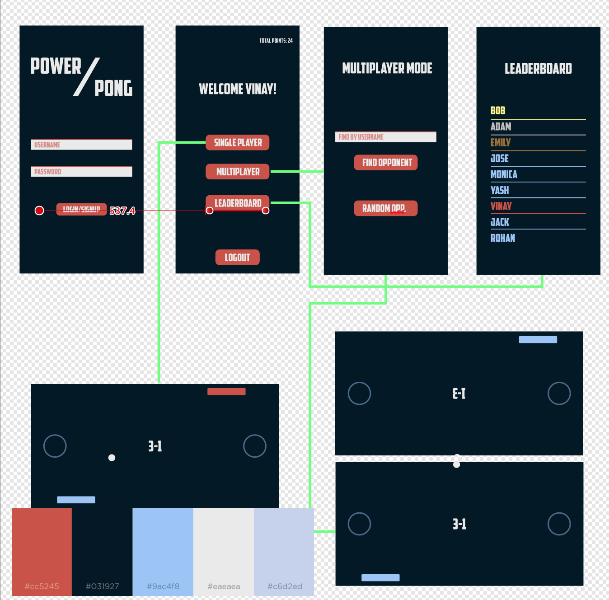

# PowerPong

TJHSST Mobile Apps Development Class

## Goal

The objective of this project was to design a fully functional Android App that can play [Pong](https://en.wikipedia.org/wiki/Pong). The main goal that this project included was to have two separate phones that could play Pong against each other. The two players would move their paddle on their own screen as the ball bounched across both screens.

## Design

